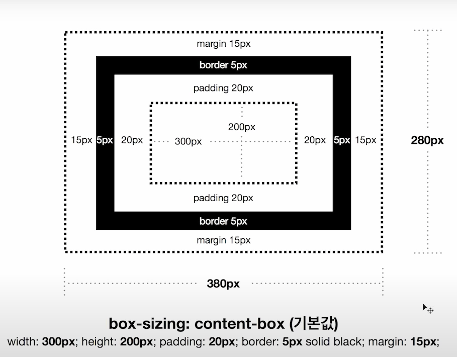
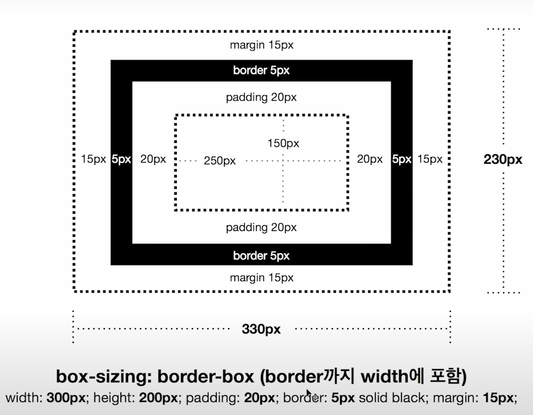

[CSS layout](https://www.youtube.com/watch?v=Zny5Vxqk6Mk&list=PLe9WXHRkq9p0k7eF0TrIHgL5Cy9khHWnX&index=5)

# css
* display: block;  
기본 설정 태그: 
, <section>   
box라 생각하라  
크기 조정 가능  

* display: inline;  
기본 설정 태그: , <a>, 
크기가 딱 사이즈 만큼  
크기 조정 불가능  

* display: inline-block;  
inline, block 2가지 속성을 가졌음  
크기 변경 가능

* display: none;  
보이지 않음, 
활용 메뉴 보이냐 안보이냐 설정에 사용

* display: flex;  
* display: grid;  

# CSS BOX MODEL
### box-sizing: content-box(기본값)

### box-sizing: border-box(border까지 width에 포함)

# rem vs em
rem html root 가지고 있는 element 1rem: 16px;
em 상위 
