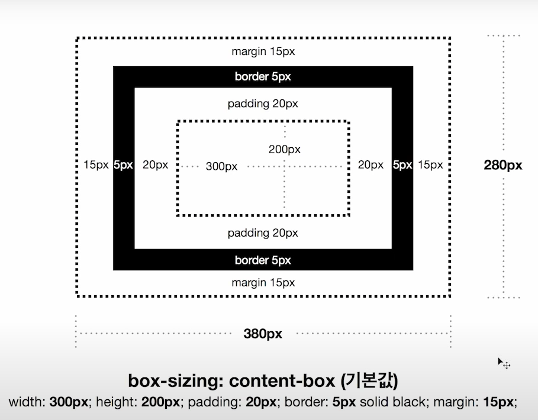
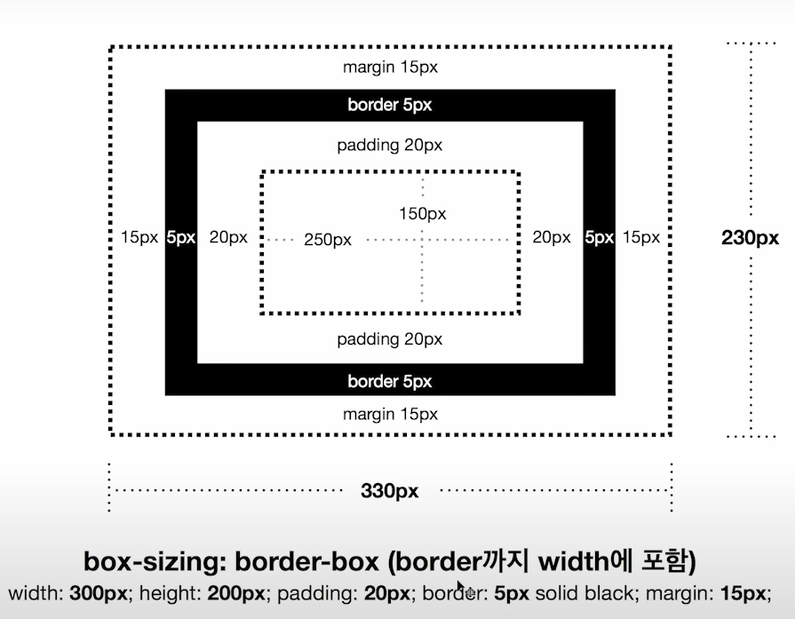

###[링크 CSS layout](https://www.youtube.com/watch?v=Zny5Vxqk6Mk&list=PLe9WXHRkq9p0k7eF0TrIHgL5Cy9khHWnX&index=5)

# css
* display: block;  
기본 설정 태그: 
, <section>   
box라 생각하라  
크기 조정 가능  

* display: inline;  
기본 설정 태그: , <a>, 
크기가 딱 사이즈 만큼  
크기 조정 불가능  

* display: inline-block;  
inline, block 2가지 속성을 가졌음  
크기 변경 가능

* display: none;  
보이지 않음, 
활용 메뉴 보이냐 안보이냐 설정에 사용

* display: flex;  
* display: grid;  

# CSS BOX MODEL
### box-sizing: content-box(기본값)

  
### box-sizing: border-box(border까지 width에 포함)

# CSS Flexbox와 CSS Grid, 한번에 정리!
[CSS Flexbox와 CSS Grid, 한번에 정리!](https://www.youtube.com/watch?v=eprXmC_j9A4&list=PLe9WXHRkq9p0k7eF0TrIHgL5Cy9khHWnX&index=5)  
01:00 .container flex  
09:30 .item flex  
15:45 flex에 숫자를 넣는 의미  
17:40 정렬  
19:20 그리드 기초  

# CSS 단위 rem, em, px 사용하는 기준 | 반응형웹
[CSS 단위 rem, em, px 사용하는 기준 | 반응형웹](https://www.youtube.com/watch?v=S5uMXoGogkk)
# rem vs em
rem html root 가지고 있는 element 1rem: 16px;
em 상위   
 
'padding'  
 - 'em' 상대적으로 변경되는 동적인 값을 원할때
 - 'px' 정확한 고정값을 원할 때
 
 'font-size'
 - 'rem' 사용
 